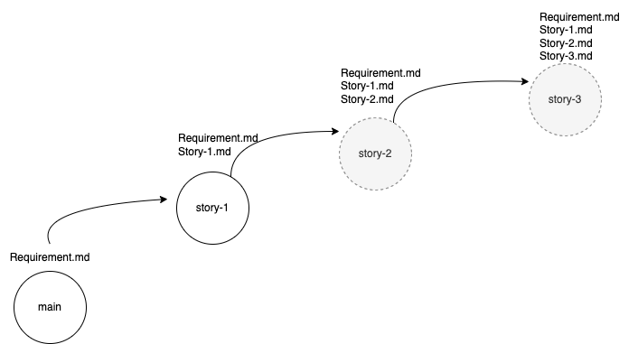
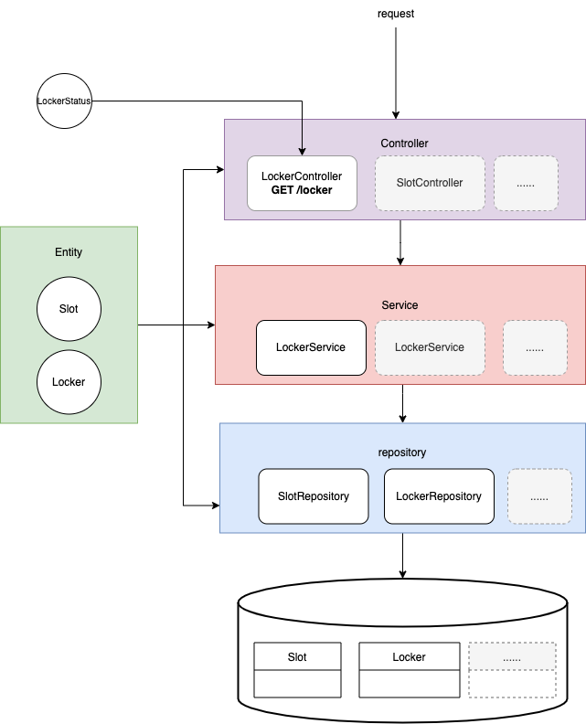

# Locker Robot

An example created by Java for TDD training.

## Available Scripts

List all tasks

```bash
./gradlew tasks
```

Run tests

```bash
./gradlew test
```

Run the locker robot server

```bash
./gradlew bootRun
```

## Memory DB

Start the server

```bash
./gradlew bootRun
```

Check the `http://localhost:8080/h2-console`.

Check the `application.properties` to get the username and password of the test database.

## Service check

Go to `http://localhost:8080/locker`.

## Requirements

### Requirement document

**Go to the specific requirement file with the prefix `story-` under the root path.**

### Requirement branch design



## Project Structure



